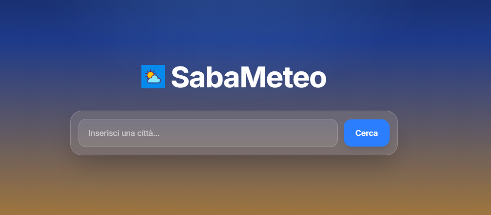
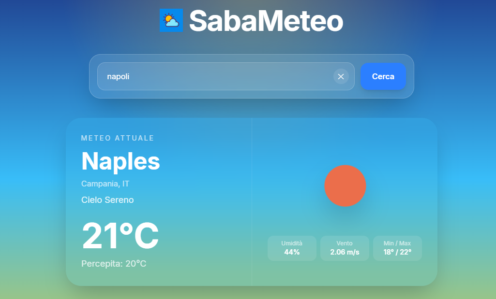
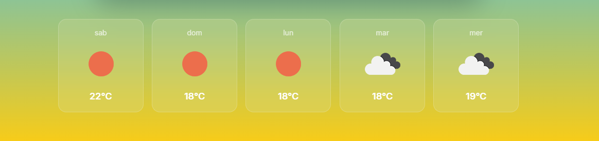

# 🌤️ SabaMeteo

SabaMeteo è una semplice applicazione meteo sviluppata per esercitarmi con **Tailwind CSS**, utilizzato per la prima volta in questo progetto.

L'obiettivo principale non era solo creare una weather app, ma imparare a costruire interfacce moderne, responsive e curate nei dettagli utilizzando Tailwind.

---

## 🚀 Demo

https://saba-meteo.vercel.app

---

## 📸 Preview

  
  
  

---

## 🎯 Obiettivi del progetto

- Imparare ad usare **Tailwind CSS** da zero
- Migliorare nella costruzione di layout **responsive (mobile-first)**
- Gestire dati da API esterne
- Creare componenti riutilizzabili in React

---

## 🧠 Cosa ho imparato

Durante lo sviluppo ho imparato:

- Come usare le utility class di Tailwind per costruire UI velocemente
- Come gestire il **responsive design** con `sm`, `md`, ecc.
- Come organizzare meglio i componenti React
- Come migliorare la **user experience** rendendo l’interfaccia più compatta e leggibile

---

## 🛠️ Tecnologie utilizzate

- React
- Tailwind CSS
- OpenWeather API

---

## ✨ Features

- Visualizzazione meteo attuale
- Visualizzazione meteo fino a 5 giorni
- Layout responsive ottimizzato per mobile
- Componenti riutilizzabili
- UI moderna

---

## 📌 Note

Questo progetto è stato realizzato principalmente a scopo didattico per prendere confidenza con Tailwind CSS.

---

## 👤 Autore

Sviluppato da Sabatino
